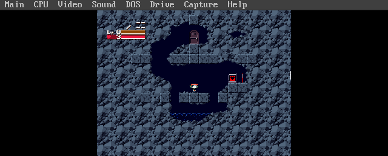

# DOSKUTSU

DOSKUTSU (a portmanteau of **DOS** + **Doukutsu Monogatari**, Cave Story's original Japanese title) is a port of [Cave Story](https://www.cavestory.org/) via [NXEngine-evo](https://github.com/nxengine/nxengine-evo) to MS-DOS 6.22. It runs Daisuke "Pixel" Amaya's 2004 freeware classic on vintage PC hardware via [SDL3](https://www.libsdl.org/)'s newly-added [DOS backend](https://github.com/libsdl-org/SDL/pull/15377), [DJGPP](https://www.delorie.com/djgpp/), and [CWSDPMI](https://en.wikipedia.org/wiki/DOS_Protected_Mode_Interface).

This project is 100% built agentically using [Claude Code](https://docs.anthropic.com/en/docs/claude-code).

<p align="center">
<a href="#requirements">Requirements</a> · <a href="#features">Features</a> · <a href="#usage">Usage</a> · <a href="#building">Building</a> · <a href="#assets">Assets</a> · <a href="#boot-profile-suggestions">Boot Profile</a> · <a href="#acknowledgments">Acknowledgments</a> · <a href="#license">License</a>
</p>

### DOSBox-X

| | |
|:---:|:---:|
|  |  |
| **Title Screen** | **Opening Transmission** |
|  |  |
| **First Lab Room** | **First Cave** |

<p align="center">captures from DOSBox-X running <code>DOSKUTSU.EXE</code></p>

---

## Why

A proof-of-concept port using SDL to DOS with agentic coding.

## Status

Phase 8 functional gate **passed** 2026-04-26 on a Gateway 2000 Pentium OverDrive 83 MHz with an ATI Mach64 video card and a Sound Blaster 16. The binary boots, NXEngine-evo runs end-to-end, the title screen renders, and the opening cutscene plays back recognizably.

**Performance on Pentium-class hardware is currently slow.** Measured ~0.47 fps title / ~0.26 fps cutscene on the PODP83 reference machine — visibly playable as a tech demo, not as a real-time game. The bottleneck is SDL3-DOS's framebuffer flush going through banked-mode VESA writes (~614 KB per frame at 16 bpp through a 64 KB bank window) instead of the linear framebuffer (LFB) the Mach64 actually exposes. Switching to LFB requires a surface-lifecycle fix in SDL3-DOS that's deferred to follow-up work — see [docs/PHASE9.md](./docs/PHASE9.md) for the optimization roadmap.

For perceptually playable framerates today, run on faster hardware (Pentium 200+ class) or under DOSBox-X with `cycles=max`.

## Requirements

**Boots and runs (functional gate)**

- CPU: 486DX with FPU (DJGPP needs x87)
- RAM: 8 MB after HIMEM
- Video: VESA 1.2+ (UNIVBE / vendor TSR like M64VBE both work)
- Sound: Sound Blaster 16-class
- OS: MS-DOS 6.22 or compatible
- Disk: ~10 MB free
- DPMI: CWSDPMI r7 (shipped alongside)

**Plays at perceptual framerates**

Real-HW performance is gated on the LFB-flush optimization tracked in `docs/PHASE9.md`. As of Phase 8 closure, achieving smooth gameplay on Pentium-class DOS hardware is open work. Recommended testing environment for now:

- DOSBox-X with `cycles=max` (~16 fps title under the parity 16 bpp build, much higher under unpatched)
- Pentium 200+ class with PCI VESA — faster CPU + LFB makes 30+ fps achievable through the existing software-render path

**Reference test hardware**

- Gateway 2000 Pentium OverDrive 83 MHz (Socket 3 P54C)
- 48 MB RAM (1 MB conventional, 47 MB XMS)
- ATI Mach64CT PCI with `M64VBE.COM`
- Creative Vibra16S (SB16-class CT2490) on IRQ 5, DMA 1/5, base 220
- CF-to-IDE storage with MS-DOS 6.22 + CWSDPMI r7

## Features

**Engine**
- Cave Story / Doukutsu Monogatari via [NXEngine-evo](https://github.com/nxengine/nxengine-evo)
- 320×240 fullscreen
- VESA 1.2+ linear framebuffer
- Software renderer

**Audio**
- Organya music synthesis
- Pixtone sound effects
- Sound Blaster 16 at 22050 Hz stereo (11025 Hz mono fallback)
- Optional OGG Vorbis for custom soundtracks

**Compatibility**
- Statically linked
- 8.3 filename compliant
- CWSDPMI shipped alongside

## Usage

```
C:\DOSKUTSU>DOSKUTSU
```

Title screen should appear within a few seconds. Controls follow NXEngine-evo's defaults:

| Key | Action |
|---|---|
| Arrow keys | Move / navigate menus |
| Z | Jump / confirm |
| X | Fire / cancel |
| A / S | Cycle weapons |
| Q | Inventory |
| W | Map |
| Escape | Pause menu |
| F11 | Toggle fullscreen (no-op on DOS — always fullscreen) |

Save files live in `DATA\Profile.dat` alongside the binary.

## Building

See [BUILDING.md](./BUILDING.md) for prerequisites, DJGPP cross-compiler install, the full four-stage build (SDL3 → SDL3_mixer → SDL3_image → NXEngine-evo), testing in DOSBox-X, and common errors.

Short version, once DJGPP is installed:

```bash
./scripts/setup-symlinks.sh     # one-time: links tools/djgpp to the emulators hub
./scripts/fetch-sources.sh      # clone the upstream repos at pinned SHAs
./scripts/apply-patches.sh      # apply DOS-port patches
make                            # orchestrates all four build stages
make smoke-fast                 # headless DOSBox-X smoke test (fast config)
```

## Assets

NXEngine-evo ships engine-support data (bitmap fonts, UI, PBM backgrounds) but not the Cave Story game assets themselves. Those must be extracted from the 2004 freeware `Doukutsu.exe` and placed under `data/base/` in the repo (gitignored).

See [docs/ASSETS.md](./docs/ASSETS.md) for the canonical source, extraction procedure, and the expected directory layout.

## Boot Profile Suggestions

DOSKUTSU runs under any DJGPP-compatible DOS boot profile with:

- `HIMEM.SYS` loaded
- `NOEMS` (DJGPP uses DPMI, not EMS — EMS page frame is wasted memory)
- SB16-compatible `BLASTER` environment variable set
- VESA 1.2+ video BIOS (UNIVBE works as a fallback)
- CTMOUSE or equivalent INT 33h mouse driver (optional — keyboard-only play is fully supported)

## Acknowledgments

- **[Cave Story / Doukutsu Monogatari](https://www.cavestory.org/)** by Daisuke "Pixel" Amaya (2004) — freeware, redistributed per Pixel's original terms
- **[NXEngine-evo](https://github.com/nxengine/nxengine-evo)** — open-source C++11 re-implementation of the Cave Story engine. GPLv3 + third-party licenses.
- **[SDL3](https://www.libsdl.org/)** by Sam Lantinga and the SDL team
- **[SDL3 DOS backend](https://github.com/libsdl-org/SDL/pull/15377)** by the PR #15377 author(s) — the piece that makes this port possible
- **[sdl2-compat](https://github.com/libsdl-org/sdl2-compat)** — SDL2-on-SDL3 compatibility shim
- **[DJGPP](https://www.delorie.com/djgpp/)** by DJ Delorie — the 32-bit DOS GCC port
- **[CWSDPMI](https://www.delorie.com/pub/djgpp/current/v2misc/)** by Charles W. Sandmann — DOS DPMI host
- **[DOSBox-X](https://dosbox-x.com/)** — DOS emulator for pre-hardware testing
- **[build-djgpp](https://github.com/andrewwutw/build-djgpp)** by Andrew Wu — installer wrapper
- **[Geomys](https://codeberg.org/ecliptik/geomys)** — sibling retro-port project, the documentation and team-structure reference
- **[Claude Code](https://claude.ai/code)** by [Anthropic](https://www.anthropic.com/)

Full attribution matrix: [THIRD-PARTY.md](./THIRD-PARTY.md).

## License

The source code in this repository — build system, scripts, port patches, and documentation — is licensed under the **MIT License**. See [LICENSE](./LICENSE).

The `DOSKUTSU.EXE` binary is GPLv3 as a combined work because it statically links [NXEngine-evo](https://github.com/nxengine/nxengine-evo), which is GPLv3. Redistributed binary bundles include a copy of the GPLv3 license text and a pointer back to this repository's source.

| Component | License | Linked into `DOSKUTSU.EXE`? |
|---|---|---|
| DOSKUTSU port source (this repo) | [MIT](./LICENSE) | n/a (source, not binary) |
| **NXEngine-evo** | **[GPLv3](https://github.com/nxengine/nxengine-evo/blob/master/LICENSE)** | **Yes — dominant license of the binary** |
| SDL3 | [zlib](https://github.com/libsdl-org/SDL/blob/main/LICENSE.txt) | Yes (zlib is GPLv3-compatible) |
| SDL3_mixer | [zlib](https://github.com/libsdl-org/SDL_mixer/blob/main/LICENSE.txt) | Yes |
| SDL3_image | [zlib](https://github.com/libsdl-org/SDL_image/blob/main/LICENSE.txt) | Yes |
| DJGPP libc | [GPL with runtime-library exception](https://www.delorie.com/djgpp/v2faq/faq11_2.html) | Yes (the exception explicitly permits static linking) |
| CWSDPMI | [freeware, redistribution permitted](./vendor/cwsdpmi/cwsdpmi.doc) | No — separate executable shipped alongside |
| LFNDOS | [GPLv2](./vendor/lfndos/COPYING) | No — separate TSR shipped alongside |
| DOSLFN | [Freeware w/sources](./vendor/doslfn/doslfn.txt) | No — separate TSR shipped alongside |
| Cave Story game data | [freeware per Pixel's 2004 terms](https://www.cavestory.org/) | No — user-extracted, not redistributed in this repo |

See [THIRD-PARTY.md](./THIRD-PARTY.md) for full attribution.
