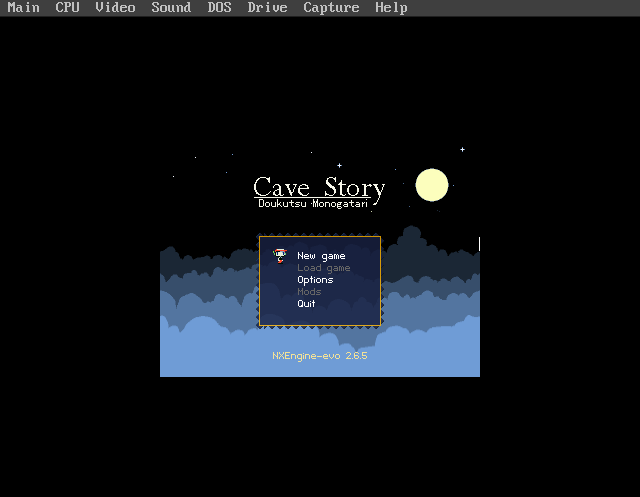
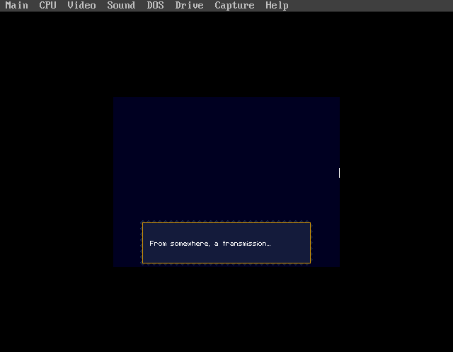
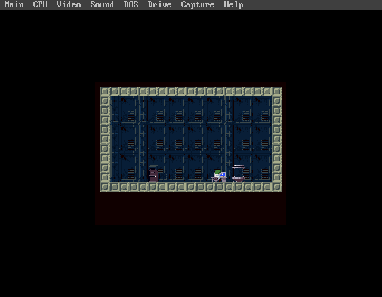
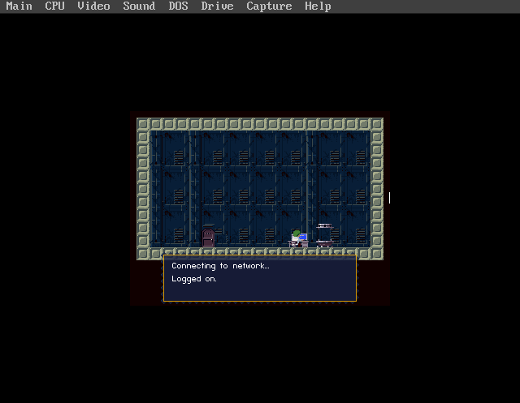

# DOSKUTSU

DOSKUTSU (a portmanteau of **DOS** + **Doukutsu Monogatari**, Cave Story's original Japanese title) is a port of [Cave Story](https://www.cavestory.org/) via [NXEngine-evo](https://github.com/nxengine/nxengine-evo) to MS-DOS 6.22. It runs Daisuke "Pixel" Amaya's 2004 freeware classic on vintage PC hardware via [SDL3](https://www.libsdl.org/)'s newly-added [DOS backend](https://github.com/libsdl-org/SDL/pull/15377), [DJGPP](https://www.delorie.com/djgpp/), and [CWSDPMI](https://en.wikipedia.org/wiki/DOS_Protected_Mode_Interface).

This project is 100% built agentically using [Claude Code](https://docs.anthropic.com/en/docs/claude-code).

| | |
|:---:|:---:|
|  |  |
| **Title Screen** | **Opening Transmission** |
|  |  |
| **First Lab Room** | **Teleporter Cutscene** |

Captures from DOSBox-X running `DOSKUTSU.EXE` under CWSDPMI; the menu bar at the top is DOSBox-X's own. Pixel-perfect 320×240 letterboxed in the emulator window.

<p align="center">
<a href="#minimum-requirements">Minimum Requirements</a> · <a href="#features">Features</a> · <a href="#usage">Usage</a> · <a href="#building">Building</a> · <a href="#assets">Assets</a> · <a href="#boot-profile-suggestions">Boot Profile</a> · <a href="#acknowledgments">Acknowledgments</a> · <a href="#license">License</a>
</p>

---

## Why

Cave Story was released in December 2004 by Daisuke "Pixel" Amaya as a single-developer freeware game — eight years after the Gateway 2000 Pentium OverDrive 83 MHz would have been obsoleted by Windows 98 machines. Running it on that hardware, through 2026 SDL tooling, is an artifact that could not have existed when either the hardware or the game were current. The port has no practical value. That is the point.

## Minimum Requirements

DOSKUTSU aims at three hardware tiers (see [docs/HARDWARE.md](./docs/HARDWARE.md) for full detail):

| Tier | CPU | RAM | Audio | Status |
|---|---|---|---|---|
| Reference | Pentium-class (Pentium OverDrive 83 MHz tested) | 48 MB | 22050 Hz stereo | Target for v1.0 |
| Achievable Minimum | 486DX2-66 with FPU | 16 MB | 11025 Hz mono (Phase 9 fallback) | Untested; expected playable |
| Absolute Minimum | **486DX2-50 with FPU** | **8 MB** | 11025 Hz mono | Stretch target; requires all Phase 9 optimizations |

All tiers also need:
- MS-DOS 6.22 or compatible (HIMEM.SYS, `NOEMS` — DJGPP uses DPMI)
- VESA 1.2+ compatible video card with linear framebuffer support (UNIVBE is a loadable fallback)
- Sound Blaster 16 or compatible at standard `BLASTER=A220 I5 D1 H5 T6`
- ~10 MB free storage for binary + CWSDPMI + engine data + Cave Story assets
- CWSDPMI r7 (shipped in the CF package)

**Hard floors:** 486DX-class or better (no 486SX without a 487 — DJGPP emits x87 code), a VESA 1.2+ BIOS (UNIVBE acceptable), at least 8 MB of RAM after HIMEM.

## Features

**Engine**
- Cave Story / Doukutsu Monogatari via [NXEngine-evo](https://github.com/nxengine/nxengine-evo) (C++11)
- 320x240 VGA, locked fullscreen — widescreen and HD code paths retained in-tree for future revisit
- VESA 1.2+ linear framebuffer with hardware page-flipping and vsync
- Software renderer (SDL3 DOS backend has no hardware-accelerated renderer on DOS)

**Audio**
- Organya synthesis (Cave Story's native 8-voice PCM tracker format) via NXEngine-evo
- Pixtone sound effect synthesis
- Sound Blaster 16 16-bit stereo at 22050 Hz (11025 mono fallback for CPU-starved configurations)
- Optional OGG Vorbis via stb_vorbis for custom soundtracks (Cave Story Remix, etc.)

**Compatibility**
- Statically linked — no shared libraries; all SDL3 + SDL3_mixer + SDL3_image linked into one binary
- CWSDPMI ships alongside `DOSKUTSU.EXE`
- Fits DOS 8.3 filename convention — `DOSKUTSU.EXE` is a legal 8-char base name

## Usage

```
C:\DOSKUTSU>DOSKUTSU
```

Title screen should appear within a few seconds. Controls follow NXEngine-evo's defaults:

| Key | Action |
|---|---|
| Arrow keys | Move / navigate menus |
| Z | Jump / confirm |
| X | Fire / cancel |
| A / S | Cycle weapons |
| Q | Inventory |
| W | Map |
| Escape | Pause menu |
| F11 | Toggle fullscreen (no-op on DOS — always fullscreen) |

Save files live in `DATA\Profile.dat` alongside the binary.

## Building

See [BUILDING.md](./BUILDING.md) for prerequisites, DJGPP cross-compiler install, the full four-stage build (SDL3 → SDL3_mixer → SDL3_image → NXEngine-evo), testing in DOSBox-X, and common errors.

Short version, once DJGPP is installed:

```bash
./scripts/setup-symlinks.sh     # one-time: links tools/djgpp to the emulators hub
./scripts/fetch-sources.sh      # clone the upstream repos at pinned SHAs
./scripts/apply-patches.sh      # apply DOS-port patches
make                            # orchestrates all four build stages
make smoke-fast                 # headless DOSBox-X smoke test (fast config)
```

## Assets

NXEngine-evo ships engine-support data (bitmap fonts, UI, PBM backgrounds) but not the Cave Story game assets themselves. Those must be extracted from the 2004 freeware `Doukutsu.exe` and placed under `data/base/` in the repo (gitignored).

See [docs/ASSETS.md](./docs/ASSETS.md) for the canonical source, extraction procedure, and the expected directory layout.

## Boot Profile Suggestions

DOSKUTSU runs under any DJGPP-compatible DOS boot profile with:

- `HIMEM.SYS` loaded
- `NOEMS` (DJGPP uses DPMI, not EMS — EMS page frame is wasted memory)
- SB16-compatible `BLASTER` environment variable set (e.g. `A220 I5 D1 H5 T6` for a SB16 / Vibra16S)
- VESA 1.2+ video BIOS (vendor VBE via `M64VBE` / `S3VBE` / similar, or UNIVBE as fallback)
- CTMOUSE or equivalent INT 33h mouse driver (optional — keyboard-only play is fully supported)

On the reference g2k machine, this matches the `[VIBRA]` CONFIG.SYS profile exactly. See [docs/BOOT.md](./docs/BOOT.md) for the full reference profile and common pitfalls.

## Benchmarks

*To be filled in once Phase 8 real-hardware testing completes. Expected targets:*

- **Pentium OverDrive 83 MHz, 22050 stereo:** 30+ FPS title screen, likely 20-25 FPS in dense combat
- **Pentium OverDrive 83 MHz, 11025 mono:** 30 FPS sustained in dense combat (fallback config)
- **DOSBox-X cycles=fixed 40000 (parity config):** matches real-HW throughput within ~10%
- **DOSBox-X cycles=max (fast config):** 4-8x faster than real HW, for quick iteration only

## Acknowledgments

- **[Claude Code](https://claude.ai/code)** by [Anthropic](https://www.anthropic.com/)
- **[Cave Story / Doukutsu Monogatari](https://www.cavestory.org/)** by Daisuke "Pixel" Amaya (2004) — freeware, redistributed per Pixel's original terms
- **[NXEngine-evo](https://github.com/nxengine/nxengine-evo)** — open-source C++11 re-implementation of the Cave Story engine. GPLv3 + third-party licenses.
- **[SDL3](https://www.libsdl.org/)** by Sam Lantinga and the SDL team
- **[SDL3 DOS backend](https://github.com/libsdl-org/SDL/pull/15377)** by the PR #15377 author(s) — the piece that makes this port possible
- **[sdl2-compat](https://github.com/libsdl-org/sdl2-compat)** — SDL2-on-SDL3 compatibility shim
- **[DJGPP](https://www.delorie.com/djgpp/)** by DJ Delorie — the 32-bit DOS GCC port
- **[CWSDPMI](https://www.delorie.com/pub/djgpp/current/v2misc/)** by Charles W. Sandmann — DOS DPMI host
- **[DOSBox-X](https://dosbox-x.com/)** — DOS emulator for pre-hardware testing
- **[build-djgpp](https://github.com/andrewwutw/build-djgpp)** by Andrew Wu — installer wrapper
- **[vellm](https://forgejo.ecliptik.com/ecliptik/vellm)** — sibling DOS port project, the toolchain and DOSBox-X automation pattern reference
- **[Geomys](https://codeberg.org/ecliptik/geomys)** and **[Flynn](https://codeberg.org/ecliptik/flynn)** — sibling retro-port projects, the documentation and team-structure reference

Full attribution matrix: [THIRD-PARTY.md](./THIRD-PARTY.md).

## License

The source code in this repository — build system, scripts, port patches, and documentation — is licensed under the **MIT License**. See [LICENSE](./LICENSE).

**The `DOSKUTSU.EXE` binary, however, is GPLv3 as a combined work** because it statically links [NXEngine-evo](https://github.com/nxengine/nxengine-evo), which is GPLv3. Redistributed binary bundles include a copy of the GPLv3 license text and a pointer back to this repository's source.

| Component | License | Linked into `DOSKUTSU.EXE`? |
|---|---|---|
| DOSKUTSU port source (this repo) | MIT | n/a (source, not binary) |
| **NXEngine-evo** | **GPLv3** | **Yes — dominant license of the binary** |
| SDL3 + SDL3_mixer + SDL3_image | zlib | Yes (zlib is GPLv3-compatible) |
| DJGPP libc | GPL with runtime-library exception | Yes (the exception explicitly permits static linking) |
| CWSDPMI | freeware, redistribution permitted with bundled `CWSDPMI.DOC` | No — separate executable shipped alongside |
| Cave Story game data | freeware per Pixel's 2004 terms | No — user-extracted, not redistributed in this repo |

See [THIRD-PARTY.md](./THIRD-PARTY.md) for full attribution and [PLAN.md § Licensing](./PLAN.md#licensing) for the full compatibility analysis.
