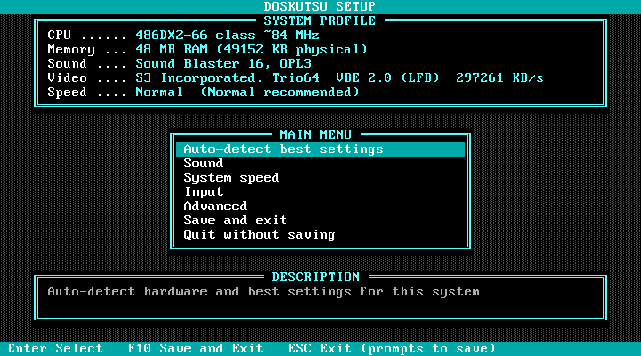

# DOSKUTSU

DOSKUTSU is a faithful port of [Cave Story](https://www.cavestory.org/) (Doukutsu Monogatari) to MS-DOS 6.22 on retro Pentium-class hardware. It plays Daisuke "Pixel" Amaya's 2004 freeware classic on real 1990s-era PCs via [SDL3](https://www.libsdl.org/)'s [DOS backend](https://github.com/libsdl-org/SDL/pull/15377), [DJGPP](https://www.delorie.com/djgpp/), and [CWSDPMI](https://en.wikipedia.org/wiki/DOS_Protected_Mode_Interface).

The name is a portmanteau of **DOS** and **Doukutsu Monogatari** (Cave Story's original Japanese title).

DOSKUTSU exists for preservation and the engineering challenge of running Cave Story on a 1990s MS-DOS PC.

<p align="center">
<a href="#quickstart">Quickstart</a> | <a href="#status">Status</a> | <a href="#download">Download</a> | <a href="#requirements">Requirements</a> | <a href="#usage">Usage</a> | <a href="#building">Building</a> | <a href="#how-this-project-is-developed">How It's Developed</a> | <a href="#components-and-license">Components and License</a>
</p>

### Screenshots

| | |
|:---:|:---:|
|  |  |
| **Title Screen** | **First Lab Room** |
|  |  |
| **First Cave** | **SETUP.EXE Main Menu** |

<p align="center">captures from DOSBox-X running <code>DOSKUTSU.EXE</code> and <code>SETUP.EXE</code></p>

### Demo

<p align="center">
<a href="https://www.youtube.com/watch?v=YLFztifZKQ8"></a>
</p>

<p align="center"><a href="https://www.youtube.com/watch?v=YLFztifZKQ8">DOSKUTSU running on Gateway 2000 reference hardware</a></p>

---

## Quickstart

1. **Get the binaries.** [Build from source](#building) or download the latest `doskutsu-<version>.zip` [release](#download) and unzip it.
2. **Add game data.** DOSKUTSU ships no Cave Story content. See [ASSETS.md](./docs/ASSETS.md) for details.
3. **Copy the folder** containing binaries and assets to a DOS system, or mount it in [DOSBox-X](https://dosbox-x.com/).
4. **Configure sound.** Run `SETUP.EXE` to auto-detect sound cards or manually configure.
5. **Play.** Run `DOSKUTSU.EXE` from the game folder.

See [Download](#download), [Game Assets](#game-assets), [Building](#building), [Usage](#usage), [Configuration](#configuration) for details.

---

## Status

**Features**

- DOSKUTSU plays the full game, start to finish
- Sound Blaster, AdLib, OPL3 FM, WaveBlaster, General MIDI, Gravis UltraSound, and PicoGUS sound support
- Original Organya soundtrack or MIDI music with selectable arrangements (see [docs/SOUND.md](./docs/SOUND.md))
- Gameport joystick/gamepad support and input remapping
- DOS-era like `SETUP.EXE` configuration utility
- Up to ~30fps (depending on CPU and bus bandwidth)
- TAS support (see [docs/TAS.md](./docs/TAS.md))

Frame rate depends on the hardware and which music backend is used:

| CPU | Music | Frame rate (median) |
|---|---|---|
| Pentium OverDrive 83 | MIDI (OPL3) | ~33 fps |
| Pentium OverDrive 83 | Organya software synth | ~21 fps |
| Am5x86-133 | MIDI (OPL3) | ~32 fps |
| 486DX2-66 | MIDI (OPL3) | ~19 fps, playable but choppy |
| 486DX2-50 | MIDI (OPL3) | ~15 fps, playable but choppy |

[docs/FPS-MATRIX.md](./docs/FPS-MATRIX.md) is the full per-CPU / per-backend matrix, including the "stutter floor" measurements and how they are taken.

Cave Story runs at 50 fps; the reference PC's hardware limits fully-detailed rendering to about 30 fps. It still plays at the correct 50 Hz speed through [Fixed-Timestep mode](#fixed-timestep-mode), which advances game logic on a fixed 50 Hz clock independent of the render rate.

See the [changelog](CHANGELOG.md) for development and progress details.

### Fixed-Timestep mode

Cave Story's engine advances game logic once per rendered frame, so at 30 fps the game also runs at about 60% speed - sluggish. Fixed-Timestep mode decouples the two: logic advances on a fixed 50 Hz clock regardless of frame rate, so the game plays at its intended speed even though the screen draws fewer frames. The motion is less smooth; the speed is correct.

It is on by default; set `SDL_HINT_DOSKUTSU_FIXED_TIMESTEP=0` to use the legacy frame-coupled loop.

### Audio backends

The soundtrack plays with either Cave Story's original Organya synthesizer or with MIDI. Organya is more faithful to the original, but has a significant performance impact; MIDI plays through a hardware synthesizer, off the CPU, and is the recommended default on DOS. Supported audio hardware:

- **Sound Blaster OPL3 FM** -- the default; works on any Sound Blaster; sound effects on the SB DAC
- **WaveBlaster / DreamBlaster** -- wavetable daughterboard on the SB16 WaveBlaster header
- **AdLib / OPL2** -- music on a card with no Sound Blaster (music only; no sound effects)
- **Gravis UltraSound** (or PicoGUS) -- GF1 wavetable music *and* sound effects; no Sound Blaster needed
- **Organya** -- Pixel's original tracker synth, in software (higher CPU cost)

The MIDI backends play a choice of music sets: an `org2mid` conversion of the original score (the default), the WiiWare arrangement, or a custom drop-in set. Pick everything in `SETUP.EXE`; [docs/SOUND.md](./docs/SOUND.md) is the sound-configuration guide and [docs/CONFIG.md](./docs/CONFIG.md) documents every setting and environment variable.

---

## Download

See **[Releases](https://github.com/ecliptik/doskutsu/releases)** for pre-built binaries or build from source (see [Building](#building)).

<!-- LATEST-RELEASE:START -->
**Latest release:** [`doskutsu-1.6.3.zip`](https://github.com/ecliptik/doskutsu/releases/download/v1.6.3/doskutsu-1.6.3.zip) (v1.6.3)
<!-- LATEST-RELEASE:END -->

Each bundle is a single `doskutsu-<version>.zip` containing `DOSKUTSU.EXE`, `SETUP.EXE`, the `CWSDPMI.EXE` DPMI host, the license texts, and NXEngine-evo's GPLv3 engine support data. The engine is the program; the game data is user-supplied, exactly the way a Doom source port ships without an IWAD.

### Game Assets

**DOSKUTSU does not include any Cave Story game data.** The binary built from this repository plays nothing on its own. Users supply their own copy of the 2004 EN freeware assets, extracted from the canonical `Doukutsu.exe`.

[docs/ASSETS.md](./docs/ASSETS.md) is the canonical, complete asset procedure - follow it start to finish; it covers fetching the freeware bundle and extracting the full data tree (maps, sprites, music, SFX) plus the expected directory layout. The two scripts below automate only the Pixtone-SFX slice of that workflow; running them alone does not produce a playable `DATA\` tree:

- `scripts/fetch-cs-pxt.py` is the one-shot orchestrator. It fetches the 2004 EN freeware bundle from [cavestory.one](https://www.cavestory.one/downloads/cavestoryen.zip) (SHA-256-pinned), extracts `Doukutsu.exe` to a tempdir, runs the Pixtone parameter extractor, and cleans up. The freeware archive does not persist on the user's machine after the script completes.
- `scripts/extract-pxt.py` is the canonical extractor, transcribed from NXEngine-evo's own `extract/extractpxt.cpp`. It operates on file offsets in `Doukutsu.exe` and emits ASCII Pixtone parameter files.

The same posture applies as the broader Cave Story port community ([NXEngine-evo](https://github.com/nxengine/nxengine-evo), [doukutsu-rs](https://github.com/doukutsu-rs/doukutsu-rs)): the engine code is open source; the game data is user-supplied freeware.

---

## Requirements

**Recommended**

- CPU: Pentium 75 MHz or faster
- RAM: 16 MB
- Video: VESA 1.2+ with 320x240 support
- Sound: Sound Blaster 16 or compatible; AdLib/OPL2-only and Gravis UltraSound (or PicoGUS) cards also supported
- OS: MS-DOS 6.22 or compatible
- Disk: 10 MB free

**Minimum**

- CPU: 486DX2-66 with FPU
- RAM: 8 MB
- Video: VESA 1.2+
- Sound: Sound Blaster 16 or compatible; AdLib/OPL2-only and Gravis UltraSound (or PicoGUS) cards also supported
- OS: MS-DOS 6.22 or compatible
- Disk: 10 MB free

---

## Usage

`DOSKUTSU.EXE`, the CWSDPMI host, and the Cave Story data all live together in one directory:

```
C:\DOSKUTSU\
  DOSKUTSU.EXE     the game
  SETUP.EXE        hardware / sound configurator (run once before first play)
  SETUP.BAT        launcher for SETUP.EXE (clears stale audio settings first)
  CWSDPMI.EXE      the DPMI host - must sit beside DOSKUTSU.EXE
  DOSKUTSU.CFG     written by SETUP.EXE (optional; the game runs without it)
  DATA\            Cave Story assets, user-extracted (see Game Assets)
```

See [Quickstart](#quickstart) to get binaries/assets and set up the game directory.

The DOS machine needs a standard DJGPP-compatible boot environment: `HIMEM.SYS` loaded, `NOEMS`, a SB16-compatible `BLASTER` variable set, and a VESA 1.2+ video BIOS (a software VESA driver works as a fallback).

Run `SETUP.EXE` once to configure sound ([Configuration](#configuration)), then
run the game:

```
C:\DOSKUTSU> SETUP          (once, to configure)
C:\DOSKUTSU> DOSKUTSU       (play)
```

The title screen appears within a few seconds. Controls follow NXEngine-evo's defaults:

| Key | Action |
|---|---|
| Arrow keys | Move / navigate menus |
| Z | Jump / confirm |
| X | Fire / cancel |
| A / S | Cycle weapons |
| Q | Inventory |
| W | Map |
| Escape | Pause menu |
| F11 | Toggle fullscreen (no-op on DOS; always fullscreen) |

Use `SETUP.EXE` to map keys and configure joystick support.

### Configuration

Use `SETUP.EXE` to configure DOSKUTSU - sound, input and other settings:

```
C:\DOSKUTSU> SETUP
```

SETUP detects the hardware, recommends settings, and configures sound,
performance, and input. It can play a real sound effect and the Title theme to
confirm audio works, then writes `DOSKUTSU.CFG`, which the game reads
at startup. See [docs/SETUP.md](./docs/SETUP.md) for the full reference and
[docs/SOUND.md](./docs/SOUND.md) for the sound-configuration guide.

Alternately, skip SETUP and use DOS environment variables (`SET` in
`AUTOEXEC.BAT` or at the prompt). Precedence is **environment variable >
`DOSKUTSU.CFG` > built-in default**. See [docs/CONFIG.md](./docs/CONFIG.md) for
every option.

---

## Building

Building needs a Linux (or WSL) host with:

- the [DJGPP](https://github.com/andrewwutw/build-djgpp) cross-compiler -- the one prerequisite that isn't a package install (~30 min one-time build)
- `cmake`, `git`, `make`, `gcc`, `python3`, `unzip`, `zip`
- `dosbox-x` -- runs the automated build-verification smoke tests

[docs/BUILDING.md](./docs/BUILDING.md) has the details: package install commands for common distros, the DJGPP install, each build stage, DOSBox-X testing, and common errors.

Once DJGPP is installed -- the one-command path:

```bash
git clone https://github.com/ecliptik/doskutsu.git   # or ssh: git@github.com:ecliptik/doskutsu.git
cd doskutsu
./scripts/bootstrap.sh          # verify prereqs, fetch upstreams, apply patches, build
```

Or run stages individually:

```bash
./scripts/setup-symlinks.sh     # one-time: link tools/djgpp (only if using the ~/emulators hub)
./scripts/fetch-sources.sh      # clone the upstream repos at pinned SHAs
./scripts/apply-patches.sh      # apply DOS-port patches
make                            # orchestrate all four build stages
make smoke-fast                 # headless DOSBox-X smoke (fast config)
make setup                      # build SETUP.EXE (the configurator)
make setup-test                 # host-side SETUP unit tests
```

`make dist` bundles the game, `CWSDPMI.EXE`, and the live-audio `SETUP.EXE`
(built with its audio backend linked in) into a ready-to-deploy archive.

---

## How This Project Is Developed

DOSKUTSU is developed agentically with [Claude Code](https://claude.com/code).

- **Claude Code authors the patches** across the SDL3 DOS backend, the NXEngine-evo engine, the build system, scripts, and docs. They land as `patches/<vendor>/NNNN-*.patch` files in this repository.
- **Human developers drive testing and iteration**: TAS replays, real-hardware playthroughs, bug reports, and deciding what to fix next.
- **Workspace-local patches only.** This project does not contribute patches upstream to [libsdl-org/SDL](https://github.com/libsdl-org/SDL), [libsdl-org/SDL_mixer](https://github.com/libsdl-org/SDL_mixer), [libsdl-org/SDL_image](https://github.com/libsdl-org/SDL_image), or [nxengine/nxengine-evo](https://github.com/nxengine/nxengine-evo).

---

## Components and License

DOSKUTSU's own source - the build system, scripts, and documentation - is **MIT-licensed** ([LICENSE](./LICENSE)). The shipped `DOSKUTSU.EXE` is **GPLv3**: it statically links NXEngine-evo, which is GPLv3, and that license governs the combined binary. The DOS-port patches under `patches/` are derivative works of their upstreams and carry those upstreams' licenses: GPLv3 for the NXEngine-evo patches, zlib for the SDL3 patches. Redistributed bundles carry the GPLv3 license text and a pointer back to this repository.

Each component below is listed with its purpose, license, and whether it links into `DOSKUTSU.EXE`:

| Component | Purpose | License | In `DOSKUTSU.EXE` |
|---|---|---|---|
| [DOSKUTSU port source](./LICENSE) (this repo) | Build system, patches, scripts, docs | MIT | n/a - source, not the binary |
| [NXEngine-evo](https://github.com/nxengine/nxengine-evo) | The C++11 re-implementation of the Cave Story engine | [GPLv3](https://github.com/nxengine/nxengine-evo/blob/master/LICENSE) | **Yes - governs the binary** |
| [SDL3](https://www.libsdl.org/) | Platform layer; its [DOS backend](https://github.com/libsdl-org/SDL/pull/15377) is what makes the port possible | [zlib](https://github.com/libsdl-org/SDL/blob/main/LICENSE.txt) | Yes |
| [SDL3_mixer](https://github.com/libsdl-org/SDL_mixer) | Audio mixing | [zlib](https://github.com/libsdl-org/SDL_mixer/blob/main/LICENSE.txt) | Yes |
| [SDL3_image](https://github.com/libsdl-org/SDL_image) | Image loading | [zlib](https://github.com/libsdl-org/SDL_image/blob/main/LICENSE.txt) | Yes |
| [DJGPP](https://www.delorie.com/djgpp/) libc | 32-bit DOS C runtime, by DJ Delorie | [GPL + runtime exception](https://www.delorie.com/djgpp/v2faq/faq11_2.html) | Yes - the exception permits static linking |
| [CWSDPMI](https://www.delorie.com/pub/djgpp/current/v2misc/) | DPMI host, by Charles W. Sandmann | [freeware, redistributable](./vendor/cwsdpmi/cwsdpmi.doc) | No - ships alongside as a separate program |
| [Cave Story](https://www.cavestory.org/) game data | Maps, sprites, music, and SFX, by Daisuke Amaya (2004) | [freeware, 2004 terms](https://www.cavestory.org/) | User extracted, not redistributed |

Built with the [DJGPP](https://www.delorie.com/djgpp/) toolchain (installed via [build-djgpp](https://github.com/andrewwutw/build-djgpp) by Andrew Wu), tested with [DOSBox-X](https://dosbox-x.com/) and real hardware.

Full attribution detail: [THIRD-PARTY.md](./THIRD-PARTY.md).
