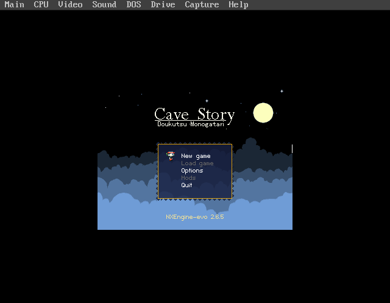
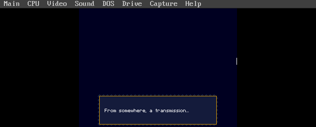
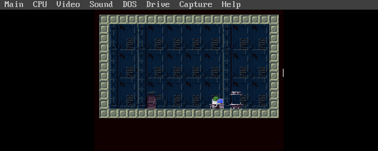
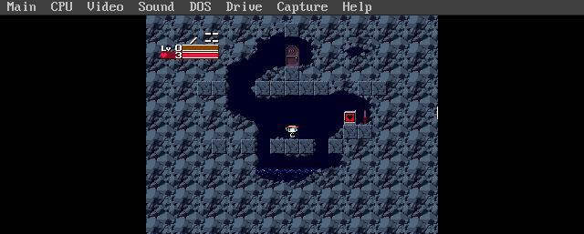

# DOSKUTSU

DOSKUTSU is a faithful port of Cave Story (Doukutsu Monogatari) to MS-DOS 6.22 on vintage Pentium-class hardware. It plays Daisuke "Pixel" Amaya's 2004 freeware classic on real 1990s-era PCs via [SDL3](https://www.libsdl.org/)'s [DOS backend](https://github.com/libsdl-org/SDL/pull/15377), [DJGPP](https://www.delorie.com/djgpp/), and [CWSDPMI](https://en.wikipedia.org/wiki/DOS_Protected_Mode_Interface).

The name is a portmanteau of **DOS** and **Doukutsu Monogatari** (Cave Story's original Japanese title).

It exists for preservation and for the engineering challenge of running a 2004 game on a 1995-era Pentium that predates it by nearly a decade.

<p align="center">
<a href="#status">Status</a> | <a href="#game-assets">Game Assets</a> | <a href="#requirements">Requirements</a> | <a href="#usage">Usage</a> | <a href="#building">Building</a> | <a href="#boot-profile">Boot Profile</a> | <a href="#how-this-project-is-developed">How It's Developed</a> | <a href="#components-and-license">Components and License</a>
</p>

### Screenshots

| | |
|:---:|:---:|
|  |  |
| **Title Screen** | **Opening Transmission** |
|  |  |
| **First Lab Room** | **First Cave** |

<p align="center">captures from DOSBox-X running <code>DOSKUTSU.EXE</code></p>

---

## Status

DOSKUTSU plays the full game start to finish: title screen, cutscenes, Mimiga Village, the caves, combat, save/load, menus.

Frame rate depends on the hardware and how music is played:

| Hardware | Music | Frame rate |
|---|---|---|
| Pentium-class (reference PC) | MIDI (OPL3 or WaveBlaster) | ~30 fps |
| Pentium-class (reference PC) | Organya software synth | ~21 fps |
| 486-class | any | designed for; not yet measured on hardware |

Audio, game speed, and hardware-compatibility options are all set with environment variables - [docs/CONFIG.md](./docs/CONFIG.md) is the full reference.

Cave Story is authored to run at 50 fps. The reference PC's memory bandwidth caps a faithful, full-detail render near 30, and no renderer work closes that gap on this hardware. The game still plays at the correct speed - see [50 Hz without 50 fps](#50-hz-without-50-fps). Per-wave performance history is in [CHANGELOG.md](./CHANGELOG.md).

### 50 Hz without 50 fps

DOSKUTSU renders at roughly 30 fps; the reference PC cannot reach the 50 fps the original runs at. Cave Story's engine normally ties game logic to the frame rate, so 30 fps also means the game advances at about 60% speed - it feels sluggish.

Fixed-Timestep mode (`SDL_HINT_DOSKUTSU_FIXED_TIMESTEP=1`) separates the two. Game logic advances on a fixed 50 Hz clock regardless of frame rate, so the game *plays* at the speed Pixel intended even though it *draws* fewer frames than the original. The motion is less smooth; the speed is correct.

It is default-OFF for now, while one background-rendering glitch is resolved; `=0` keeps the original frame-coupled behavior.

### Audio backends

The soundtrack plays one of two ways. **Organya** is Cave Story's original `.org` software synthesizer - the exact 2004 sound - but it mixes every audio tick on the CPU, which costs roughly 9 fps on a Pentium (the ~21 fps row above). Enable it with `SET SDL_HINT_DOSKUTSU_AUDIO_BACKEND=organya`.

**MIDI is the default and the recommended choice**: the soundtrack plays as converted MIDI on a hardware synthesizer, off the CPU, for the full frame rate. Two settings shape it:

| Setting | Environment variable | Options | Picks |
|---|---|---|---|
| Synthesizer | `SDL_HINT_DOSKUTSU_AUDIO_BACKEND` | `opl3` (default), `wb` | `opl3`: the SB16 / Sound Blaster Pro 2 OPL3 FM chip. `wb`: a WaveBlaster daughterboard (the hardware is required) |
| MIDI source | `SDL_HINT_DOSKUTSU_AUDIO_MIDI_SOURCE` | `wiimidi` (default), `orgmid` | `wiimidi`: the WiiWare arrangement, which tracks the original closely. `orgmid`: the Hart legacy `.mid` set |
| GM variant | `SDL_HINT_DOSKUTSU_AUDIO_MIDI_GM_VARIANT` | `v1`, `v2` | an `org2mid`-converted General MIDI variant |

---

## Game Assets

**DOSKUTSU does not include any Cave Story game data.** The binary you build from this repository plays nothing on its own. Users supply their own copy of Pixel's 2004 EN freeware assets, extracted from the canonical `Doukutsu.exe`.

[docs/ASSETS.md](./docs/ASSETS.md) is the canonical, complete asset procedure - follow it start to finish; it covers fetching the freeware bundle and extracting the full data tree (maps, sprites, music, SFX) plus the expected directory layout. The two scripts below automate only the Pixtone-SFX slice of that workflow; running them alone does not produce a playable `DATA\` tree:

- `scripts/fetch-cs-pxt.py` is the one-shot orchestrator. It fetches the 2004 EN freeware bundle from [cavestory.one](https://www.cavestory.one/downloads/cavestoryen.zip) (SHA-256-pinned), extracts `Doukutsu.exe` to a tempdir, runs the Pixtone parameter extractor, and cleans up. Pixel's freeware archive does not persist on the user's machine after the script completes.
- `scripts/extract-pxt.py` is the canonical extractor, transcribed from NXEngine-evo's own `extract/extractpxt.cpp`. It operates on file offsets in `Doukutsu.exe` and emits ASCII Pixtone parameter files.

The same posture applies as the broader Cave Story port community ([NXEngine-evo](https://github.com/nxengine/nxengine-evo), [doukutsu-rs](https://github.com/doukutsu-rs/doukutsu-rs)): the engine code is open source; the game data is user-supplied freeware.

---

## Requirements

DOSKUTSU targets two hardware tiers.

**Tier 1 - Reference (tested).** The configuration every real-hardware measurement is taken on:

- CPU: Pentium 75 MHz or faster
- RAM: 16 MB or more
- Video: VESA 1.2+ with 320x240 support (a software VESA driver such as [UniVBE](https://en.wikipedia.org/wiki/UniVBE) covers cards whose firmware lacks it)
- Sound: Sound Blaster 16 or compatible
- OS: MS-DOS 6.22 or compatible
- Disk: ~10 MB free

**Tier 2 - Minimum (designed for, not yet tested on hardware):**

- CPU: 486DX2-66 with FPU
- RAM: 8 MB or more
- Video: VESA 1.2+
- Sound: any SB16-compatible

Three hard floors: an FPU is required (DJGPP emits x87 instructions, so a 486SX needs a 487 coprocessor); video must be VESA 1.2+ with a linear framebuffer, which the SDL3 DOS backend depends on; and the DOS environment must host CWSDPMI's DPMI 0.9 service.

---

## Usage

`DOSKUTSU.EXE`, the CWSDPMI host, and the Cave Story data all live together in one directory:

```
C:\DOSKUTSU\
  DOSKUTSU.EXE     the game
  CWSDPMI.EXE      the DPMI host - must sit beside DOSKUTSU.EXE
  DATA\            Cave Story assets, extracted by you (see Game Assets)
```

Quick setup:

1. Get `DOSKUTSU.EXE` - build it ([Building](#building)) or take it from a release bundle.
2. Get `CWSDPMI.EXE`. You do not download this yourself: the build tooling fetches it (from its upstream, at a pinned checksum) via `make fetch-binaries`, which `make install` and `make dist` run automatically. Release bundles already include it.
3. Extract the Cave Story data into `DATA\` ([Game Assets](#game-assets)).
4. Copy the whole directory to the DOS machine.

`make install CF=...` writes this layout straight to a mounted card, and `make dist` packages it as a zip.

Run it from the game directory:

```
C:\DOSKUTSU> DOSKUTSU
```

The title screen appears within a few seconds. Controls follow NXEngine-evo's defaults:

| Key | Action |
|---|---|
| Arrow keys | Move / navigate menus |
| Z | Jump / confirm |
| X | Fire / cancel |
| A / S | Cycle weapons |
| Q | Inventory |
| W | Map |
| Escape | Pause menu |
| F11 | Toggle fullscreen (no-op on DOS; always fullscreen) |

Save files live in `DATA\Profile.dat` alongside the binary.

---

## Building

Full build documentation in [docs/BUILDING.md](./docs/BUILDING.md): prerequisites, DJGPP cross-compiler install, the four-stage build (SDL3, SDL3_mixer, SDL3_image, NXEngine-evo), DOSBox-X testing, common errors.

Short version, once DJGPP is installed:

```bash
git clone ssh://git@forgejo.ecliptik.com/ecliptik/doskutsu.git
cd doskutsu
./scripts/setup-symlinks.sh     # one-time: link tools/djgpp to the emulators hub
./scripts/fetch-sources.sh      # clone the upstream repos at pinned SHAs
./scripts/apply-patches.sh      # apply DOS-port patches
make                            # orchestrate all four build stages
make smoke-fast                 # headless DOSBox-X smoke (fast config)
```

---

## Boot Profile

DOSKUTSU runs under any DJGPP-compatible DOS boot profile with:

- `HIMEM.SYS` loaded
- `NOEMS` (DJGPP uses DPMI, not EMS; an EMS page frame just wastes UMB space)
- SB16-compatible `BLASTER` environment variable set
- VESA 1.2+ video BIOS (UniVBE works as a fallback)

---

## How This Project Is Developed

DOSKUTSU is developed agentically with [Claude Code](https://claude.com/code).

- **Claude Code authors the patches** across the SDL3 DOS backend, the NXEngine-evo engine, the build system, scripts, and docs. They land as `patches/<vendor>/NNNN-*.patch` files in this repository.
- **Human developers drive testing and iteration**: TAS replays, real-hardware playthroughs, bug reports, and deciding what to fix next.
- **Workspace-local patches only.** This project does not contribute patches upstream to [libsdl-org/SDL](https://github.com/libsdl-org/SDL), [libsdl-org/SDL_mixer](https://github.com/libsdl-org/SDL_mixer), [libsdl-org/SDL_image](https://github.com/libsdl-org/SDL_image), or [nxengine/nxengine-evo](https://github.com/nxengine/nxengine-evo).

---

## Components and License

DOSKUTSU's own source - the build system, scripts, and documentation - is **MIT-licensed** ([LICENSE](./LICENSE)). The shipped `DOSKUTSU.EXE` is **GPLv3**: it statically links NXEngine-evo, which is GPLv3, and that license governs the combined binary. The DOS-port patches under `patches/` are derivative works of their upstreams and carry those upstreams' licenses: GPLv3 for the NXEngine-evo patches, zlib for the SDL3 patches. Redistributed bundles carry the GPLv3 license text and a pointer back to this repository.

Each component below is listed with its purpose, license, and whether it links into `DOSKUTSU.EXE`:

| Component | Purpose | License | In `DOSKUTSU.EXE` |
|---|---|---|---|
| [DOSKUTSU port source](./LICENSE) (this repo) | Build system, patches, scripts, docs | MIT | n/a - source, not the binary |
| [NXEngine-evo](https://github.com/nxengine/nxengine-evo) | The C++11 re-implementation of the Cave Story engine | [GPLv3](https://github.com/nxengine/nxengine-evo/blob/master/LICENSE) | **Yes - governs the binary** |
| [SDL3](https://www.libsdl.org/) | Platform layer; its [DOS backend](https://github.com/libsdl-org/SDL/pull/15377) is what makes the port possible | [zlib](https://github.com/libsdl-org/SDL/blob/main/LICENSE.txt) | Yes |
| [SDL3_mixer](https://github.com/libsdl-org/SDL_mixer) | Audio mixing | [zlib](https://github.com/libsdl-org/SDL_mixer/blob/main/LICENSE.txt) | Yes |
| [SDL3_image](https://github.com/libsdl-org/SDL_image) | Image loading | [zlib](https://github.com/libsdl-org/SDL_image/blob/main/LICENSE.txt) | Yes |
| [DJGPP](https://www.delorie.com/djgpp/) libc | 32-bit DOS C runtime, by DJ Delorie | [GPL + runtime exception](https://www.delorie.com/djgpp/v2faq/faq11_2.html) | Yes - the exception permits static linking |
| [CWSDPMI](https://www.delorie.com/pub/djgpp/current/v2misc/) | DPMI host, by Charles W. Sandmann | [freeware, redistributable](./vendor/cwsdpmi/cwsdpmi.doc) | No - ships alongside as a separate program |
| [Cave Story](https://www.cavestory.org/) game data | Maps, sprites, music, and SFX, by Daisuke "Pixel" Amaya (2004) | [freeware, Pixel's 2004 terms](https://www.cavestory.org/) | No - you extract it yourself; not redistributed here |

Built with the [DJGPP](https://www.delorie.com/djgpp/) toolchain (installed via [build-djgpp](https://github.com/andrewwutw/build-djgpp) by Andrew Wu), tested with [DOSBox-X](https://dosbox-x.com/) and real hardware.

Full attribution detail: [THIRD-PARTY.md](./THIRD-PARTY.md).
