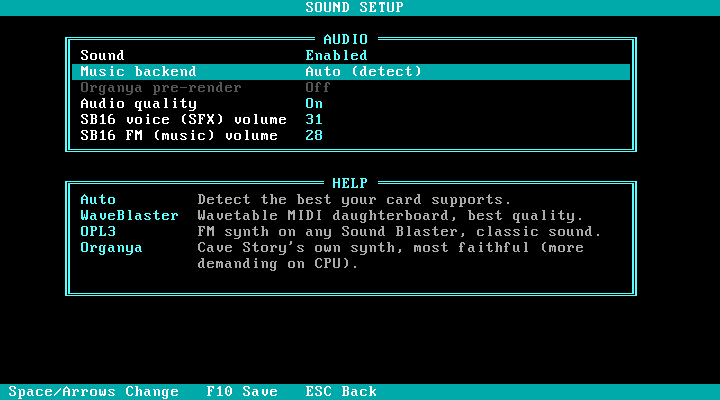

# DOSKUTSU

DOSKUTSU is a faithful port of [Cave Story](https://www.cavestory.org/) (Doukutsu Monogatari) to MS-DOS 6.22 on retro Pentium-class hardware. It plays Daisuke "Pixel" Amaya's 2004 freeware classic on real 1990s-era PCs via [SDL3](https://www.libsdl.org/)'s [DOS backend](https://github.com/libsdl-org/SDL/pull/15377), [DJGPP](https://www.delorie.com/djgpp/), and [CWSDPMI](https://en.wikipedia.org/wiki/DOS_Protected_Mode_Interface).

The name is a portmanteau of **DOS** and **Doukutsu Monogatari** (Cave Story's original Japanese title).

DOSKUTSU exists for preservation and the engineering challenge of running Cave Story on a 1990s MS-DOS PC.

<p align="center">
<a href="#status">Status</a> | <a href="#quickstart">Quickstart</a> | <a href="#download">Download</a> | <a href="#game-assets">Game Assets</a> | <a href="#requirements">Requirements</a> | <a href="#usage">Usage</a> | <a href="#configuration">Configuration</a> | <a href="#building">Building</a> | <a href="#how-this-project-is-developed">How It's Developed</a> | <a href="#components-and-license">Components and License</a>
</p>

### Screenshots

| | |
|:---:|:---:|
|  |  |
| **Title Screen** | **Opening Transmission** |
|  |  |
| **First Lab Room** | **First Cave** |
|  |  |
| **SETUP.EXE Main Menu** | **SETUP.EXE Sound Configuration** |

<p align="center">captures from DOSBox-X running <code>DOSKUTSU.EXE</code> and <code>SETUP.EXE</code></p>

### Video

<p align="center">
<a href="https://www.youtube.com/watch?v=YLFztifZKQ8"></a>
</p>

<p align="center"><a href="https://www.youtube.com/watch?v=YLFztifZKQ8">doskutsu running on Gateway 2000 reference hardware</a></p>

---

## Status

DOSKUTSU plays the full game, start to finish.

Frame rate depends on the hardware and which music backend is used. Measured with a fixed input recording (TAS replay) in a heavy-music scene, on the reference board with a Cirrus CL-GD5430:

| CPU | Music | Frame rate (median) |
|---|---|---|
| Pentium OverDrive 83 | MIDI (OPL3) | ~33 fps |
| Pentium OverDrive 83 | Organya software synth | ~21 fps |
| Am5x86-133 | MIDI (OPL3) | ~32 fps |
| 486DX2-66 | MIDI (OPL3) | ~19 fps, playable but choppy |
| 486DX2-50 | MIDI (OPL3) | ~15 fps, playable but choppy |

[docs/FPS-MATRIX.md](./docs/FPS-MATRIX.md) is the full per-CPU / per-backend matrix, including the "stutter floor" measurements and how they are taken.

Cave Story runs at 50 fps; the reference PC's hardware limits fully-detailed rendering to about 30 fps. It still plays at the correct 50 Hz speed through [Fixed-Timestep mode](#fixed-timestep-mode), which advances game logic on a fixed 50 Hz clock independent of the render rate.

See the [changelog](CHANGELOG.md) for development and progress details.

### Fixed-Timestep mode

Cave Story's engine advances game logic once per rendered frame, so at 30 fps the game also runs at about 60% speed - sluggish. Fixed-Timestep mode decouples the two: logic advances on a fixed 50 Hz clock regardless of frame rate, so the game plays at its intended speed even though the screen draws fewer frames. The motion is less smooth; the speed is correct.

It is on by default as of 1.0; set `SDL_HINT_DOSKUTSU_FIXED_TIMESTEP=0` to use the legacy frame-coupled loop.

### Audio backends

The soundtrack plays with either Cave Story's original Organya synthesizer or with MIDI. Organya is more faithful to the original, but has a significant performance impact; MIDI is recommended and the default for playing on DOS.

MIDI plays through a hardware synthesizer, off the CPU. These settings shape the sound:

| Setting | Environment variable | Options | Picks |
|---|---|---|---|
| Synthesizer | `SDL_HINT_DOSKUTSU_AUDIO_BACKEND` | `auto` (default), `wb`, `opl3`, `organya`, `adlib`, `gus`, `none` | `auto`: probe WaveBlaster daughterboard first, fall back to OPL3 FM; explicit values force a specific backend. `wb`: WaveBlaster / DreamBlaster-class wavetable daughterboard on the SB16 WaveBlaster header (validated on Vibra16S CT2490 + DreamBlaster S2). `opl3`: the SB16 / Sound Blaster Pro 2 OPL3 FM chip. `organya`: software synthesis of Pixel's original Cave Story tracker format (higher CPU cost). `adlib`: native OPL2 FM for a machine with an AdLib/OPL card but **no Sound Blaster** (or a PicoGUS in `/mode adlib`); music is clocked off the PIT timer instead of the SB interrupt. **Music only** -- a DAC-less AdLib card has no sound effects. `gus`: native Gravis UltraSound (GF1) wavetable for a machine with **no Sound Blaster** (a real GUS, or a PicoGUS in `/mode gus`); plays **both music and sound effects** on the GF1's hardware voices. `none`: music off (sound effects still play). See `docs/CONFIG.md`. |
| MIDI source | `SDL_HINT_DOSKUTSU_AUDIO_MIDI_SOURCE` | `orgmid2` (default), `wiimidi`, `orgmid`, `<dir>` | `orgmid2`: the native-GM `org2mid` conversion (`data/orgmid2/`, generated with `make convert-music`; falls back to `wiimidi` if absent). `wiimidi`: the WiiWare arrangement, which tracks the original closely. `orgmid`: the Hart legacy `.mid` set. Any other value: a custom drop-in directory of your own `.mid` files in `data/<dir>/` (see `docs/ASSETS.md`) |
| GM variant | `SDL_HINT_DOSKUTSU_AUDIO_MIDI_GM_VARIANT` | `v1`, `v2` | an `org2mid`-converted General MIDI variant |
| Sound effects | `SDL_HINT_DOSKUTSU_SFX_DEVICE` | `sb` (default), `none` | `sb`: sound effects on the Sound Blaster DAC. `none`: sound effects off (music still plays). Under `gus`, effects play on the GF1 wavetable automatically |

[docs/SOUND.md](./docs/SOUND.md) is the consolidated sound-configuration guide (per-card recommendations, GUS patch sets and voice counts); [docs/CONFIG.md](./docs/CONFIG.md) documents every variable.

---

## Quickstart

From nothing to playing, in five steps:

1. **Get the binaries.** [Build from source](#building) -- or, once releases are published, download the latest `doskutsu-<version>.zip` from [Download](#download) and unzip it. Either way you get `DOSKUTSU.EXE`, `SETUP.EXE`, `CWSDPMI.EXE`, and the engine `DATA\`.
2. **Add the game data.** DOSKUTSU ships no Cave Story content. Extract it from your own 2004 freeware `Doukutsu.exe` into `DATA\` -- the [quick path in ASSETS.md](docs/ASSETS.md#quick-path-most-people-want-this) is the shortest route. (Like a Doom source port: the engine is here, you bring the game data.)
3. **Put it on a DOS system.** Copy the whole folder to a CF card or hard disk on a Pentium-class DOS PC -- or mount it in [DOSBox-X](https://dosbox-x.com/) to try it on a modern machine first.
4. **Configure sound.** Run `SETUP` once; it detects your sound card and lets you test it before you play.
5. **Play.** Run `DOSKUTSU`.

More detail at each step: [Download](#download), [Game Assets](#game-assets), [Building](#building), [Usage](#usage), [Configuration](#configuration).

---

## Download

Pre-built bundles are published on the **[GitHub Releases](https://github.com/ecliptik/doskutsu/releases)** page. Prefer to build the exact source you see here? `make dist` produces the identical `doskutsu-<version>.zip` bundle -- see [Building](#building).

<!-- LATEST-RELEASE:START -->
**Latest release:** [`doskutsu-1.6.3.zip`](https://github.com/ecliptik/doskutsu/releases/download/v1.6.3/doskutsu-1.6.3.zip) (v1.6.3)
<!-- LATEST-RELEASE:END -->

Each bundle is a single `doskutsu-<version>.zip` containing `DOSKUTSU.EXE`, `SETUP.EXE`, the `CWSDPMI.EXE` DPMI host, the license texts, and NXEngine-evo's GPLv3 engine support data. It does **not** include Cave Story game content -- the maps, sprites, music, and SFX come from your own copy of Pixel's 2004 freeware `Doukutsu.exe` (see [Game Assets](#game-assets)). The engine is the program; the game data is yours to supply, exactly the way a Doom source port ships without an IWAD.

---

## Game Assets

**DOSKUTSU does not include any Cave Story game data.** The binary built from this repository plays nothing on its own. Users supply their own copy of the 2004 EN freeware assets, extracted from the canonical `Doukutsu.exe`.

[docs/ASSETS.md](./docs/ASSETS.md) is the canonical, complete asset procedure - follow it start to finish; it covers fetching the freeware bundle and extracting the full data tree (maps, sprites, music, SFX) plus the expected directory layout. The two scripts below automate only the Pixtone-SFX slice of that workflow; running them alone does not produce a playable `DATA\` tree:

- `scripts/fetch-cs-pxt.py` is the one-shot orchestrator. It fetches the 2004 EN freeware bundle from [cavestory.one](https://www.cavestory.one/downloads/cavestoryen.zip) (SHA-256-pinned), extracts `Doukutsu.exe` to a tempdir, runs the Pixtone parameter extractor, and cleans up. The freeware archive does not persist on the user's machine after the script completes.
- `scripts/extract-pxt.py` is the canonical extractor, transcribed from NXEngine-evo's own `extract/extractpxt.cpp`. It operates on file offsets in `Doukutsu.exe` and emits ASCII Pixtone parameter files.

The same posture applies as the broader Cave Story port community ([NXEngine-evo](https://github.com/nxengine/nxengine-evo), [doukutsu-rs](https://github.com/doukutsu-rs/doukutsu-rs)): the engine code is open source; the game data is user-supplied freeware.

---

## Requirements

**Recommended**

- CPU: Pentium 75 MHz or faster
- RAM: 16 MB
- Video: VESA 1.2+ with 320x240 support
- Sound: Sound Blaster 16 or compatible; AdLib/OPL2-only and Gravis UltraSound (or PicoGUS) cards also supported
- OS: MS-DOS 6.22 or compatible
- Disk: 10 MB free

**Minimum**

- CPU: 486DX2-66 with FPU
- RAM: 8 MB
- Video: VESA 1.2+
- Sound: Sound Blaster 16 or compatible; AdLib/OPL2-only and Gravis UltraSound (or PicoGUS) cards also supported
- OS: MS-DOS 6.22 or compatible
- Disk: 10 MB free

---

## Usage

`DOSKUTSU.EXE`, the CWSDPMI host, and the Cave Story data all live together in one directory:

```
C:\DOSKUTSU\
  DOSKUTSU.EXE     the game
  SETUP.EXE        hardware / sound configurator (run once before first play)
  CWSDPMI.EXE      the DPMI host - must sit beside DOSKUTSU.EXE
  DOSKUTSU.CFG     written by SETUP.EXE (optional; the game runs without it)
  DATA\            Cave Story assets, user-extracted (see Game Assets)
```

Assemble this directory via the [Quickstart](#quickstart) steps: get the binaries, extract the Cave Story data into `DATA\` ([Game Assets](#game-assets)), and copy the whole directory to the DOS machine. (`CWSDPMI.EXE` is not a manual download -- the build tooling fetches it from its upstream at a pinned checksum, `make dist` / `make install` include it, and release bundles ship it.)

The DOS machine needs a standard DJGPP-compatible boot environment: `HIMEM.SYS` loaded, `NOEMS`, a SB16-compatible `BLASTER` variable set, and a VESA 1.2+ video BIOS (a software VESA driver works as a fallback).

Before the first play, run `SETUP` (or `SETUP.BAT`) to detect your hardware and
configure sound -- see [Configuration](#configuration). Then run the game from
the game directory:

```
C:\DOSKUTSU> SETUP          (once, to configure)
C:\DOSKUTSU> DOSKUTSU       (play)
```

The title screen appears within a few seconds. Controls follow NXEngine-evo's defaults:

| Key | Action |
|---|---|
| Arrow keys | Move / navigate menus |
| Z | Jump / confirm |
| X | Fire / cancel |
| A / S | Cycle weapons |
| Q | Inventory |
| W | Map |
| Escape | Pause menu |
| F11 | Toggle fullscreen (no-op on DOS; always fullscreen) |

These are the defaults - keyboard keys are remappable and a gameport joystick /
flightstick is supported (2 axes + 4 buttons). Configure both in `SETUP.EXE`
under **Input**: remap keys, assign buttons, calibrate the stick, and invert the
Y axis if its pitch reads backwards. (1.2.0+)

---

## Configuration

The easy way is `SETUP.EXE` - a classic DOS-style configurator. Run it before
your first play (or whenever your hardware changes):

```
C:\DOSKUTSU> SETUP
```

SETUP detects your machine (CPU, memory, sound card from your `BLASTER`
variable, WaveBlaster / OPL3, video), recommends settings, and lets you choose
the music backend and volumes, the Sound Blaster port / IRQ / DMA, performance
mode, and input (remap the keyboard, assign / calibrate a gameport joystick).
It can play the **real Polar Star sound effect and
Title theme** through your chosen backend so you can confirm sound works before
launching the game, then writes `DOSKUTSU.CFG`, which the game loads at startup.

Auto-detect recommends **OPL3** FM music (works on any Sound Blaster); a
WaveBlaster daughterboard is never selected automatically - pick it yourself in
SETUP if you have one. Settings precedence is **environment variable >
`DOSKUTSU.CFG` > built-in default**, with one deliberate exception: a `BLASTER`
line written by SETUP is authoritative and overrides an ambient `SET BLASTER`.
[docs/SETUP.md](./docs/SETUP.md) is the full SETUP + `DOSKUTSU.CFG` reference.

You can also skip SETUP and configure DOSKUTSU directly through DOS environment
variables - the music backend, the Fixed-Timestep game-speed mode, audio
quality, and hardware-compatibility fallbacks - set with `SET` in `AUTOEXEC.BAT`
or at the DOS prompt. [docs/CONFIG.md](./docs/CONFIG.md) is the complete
environment-variable reference: every option with its values, defaults, usage
examples, and performance impact.

---

## Building

Full build documentation in [docs/BUILDING.md](./docs/BUILDING.md): prerequisites, DJGPP cross-compiler install, the four-stage build (SDL3, SDL3_mixer, SDL3_image, NXEngine-evo), DOSBox-X testing, common errors.

Short version, once DJGPP is installed -- the one-command path:

```bash
git clone https://github.com/ecliptik/doskutsu.git   # or ssh: git@github.com:ecliptik/doskutsu.git
cd doskutsu
./scripts/bootstrap.sh          # verify prereqs, fetch upstreams, apply patches, build
```

Or run the stages yourself:

```bash
./scripts/setup-symlinks.sh     # one-time: link tools/djgpp (only if using the ~/emulators hub)
./scripts/fetch-sources.sh      # clone the upstream repos at pinned SHAs
./scripts/apply-patches.sh      # apply DOS-port patches
make                            # orchestrate all four build stages
make smoke-fast                 # headless DOSBox-X smoke (fast config)
make setup                      # build SETUP.EXE (the configurator)
make setup-test                 # host-side SETUP unit tests
```

`make dist` bundles the game, `CWSDPMI.EXE`, and the live-audio `SETUP.EXE`
(built with its audio backend linked in) into a ready-to-deploy archive.

---

## How This Project Is Developed

DOSKUTSU is developed agentically with [Claude Code](https://claude.com/code).

- **Claude Code authors the patches** across the SDL3 DOS backend, the NXEngine-evo engine, the build system, scripts, and docs. They land as `patches/<vendor>/NNNN-*.patch` files in this repository.
- **Human developers drive testing and iteration**: TAS replays, real-hardware playthroughs, bug reports, and deciding what to fix next.
- **Workspace-local patches only.** This project does not contribute patches upstream to [libsdl-org/SDL](https://github.com/libsdl-org/SDL), [libsdl-org/SDL_mixer](https://github.com/libsdl-org/SDL_mixer), [libsdl-org/SDL_image](https://github.com/libsdl-org/SDL_image), or [nxengine/nxengine-evo](https://github.com/nxengine/nxengine-evo).

---

## Components and License

DOSKUTSU's own source - the build system, scripts, and documentation - is **MIT-licensed** ([LICENSE](./LICENSE)). The shipped `DOSKUTSU.EXE` is **GPLv3**: it statically links NXEngine-evo, which is GPLv3, and that license governs the combined binary. The DOS-port patches under `patches/` are derivative works of their upstreams and carry those upstreams' licenses: GPLv3 for the NXEngine-evo patches, zlib for the SDL3 patches. Redistributed bundles carry the GPLv3 license text and a pointer back to this repository.

Each component below is listed with its purpose, license, and whether it links into `DOSKUTSU.EXE`:

| Component | Purpose | License | In `DOSKUTSU.EXE` |
|---|---|---|---|
| [DOSKUTSU port source](./LICENSE) (this repo) | Build system, patches, scripts, docs | MIT | n/a - source, not the binary |
| [NXEngine-evo](https://github.com/nxengine/nxengine-evo) | The C++11 re-implementation of the Cave Story engine | [GPLv3](https://github.com/nxengine/nxengine-evo/blob/master/LICENSE) | **Yes - governs the binary** |
| [SDL3](https://www.libsdl.org/) | Platform layer; its [DOS backend](https://github.com/libsdl-org/SDL/pull/15377) is what makes the port possible | [zlib](https://github.com/libsdl-org/SDL/blob/main/LICENSE.txt) | Yes |
| [SDL3_mixer](https://github.com/libsdl-org/SDL_mixer) | Audio mixing | [zlib](https://github.com/libsdl-org/SDL_mixer/blob/main/LICENSE.txt) | Yes |
| [SDL3_image](https://github.com/libsdl-org/SDL_image) | Image loading | [zlib](https://github.com/libsdl-org/SDL_image/blob/main/LICENSE.txt) | Yes |
| [DJGPP](https://www.delorie.com/djgpp/) libc | 32-bit DOS C runtime, by DJ Delorie | [GPL + runtime exception](https://www.delorie.com/djgpp/v2faq/faq11_2.html) | Yes - the exception permits static linking |
| [CWSDPMI](https://www.delorie.com/pub/djgpp/current/v2misc/) | DPMI host, by Charles W. Sandmann | [freeware, redistributable](./vendor/cwsdpmi/cwsdpmi.doc) | No - ships alongside as a separate program |
| [Cave Story](https://www.cavestory.org/) game data | Maps, sprites, music, and SFX, by Daisuke Amaya (2004) | [freeware, 2004 terms](https://www.cavestory.org/) | User extracted, not redistributed |

Built with the [DJGPP](https://www.delorie.com/djgpp/) toolchain (installed via [build-djgpp](https://github.com/andrewwutw/build-djgpp) by Andrew Wu), tested with [DOSBox-X](https://dosbox-x.com/) and real hardware.

Full attribution detail: [THIRD-PARTY.md](./THIRD-PARTY.md).
