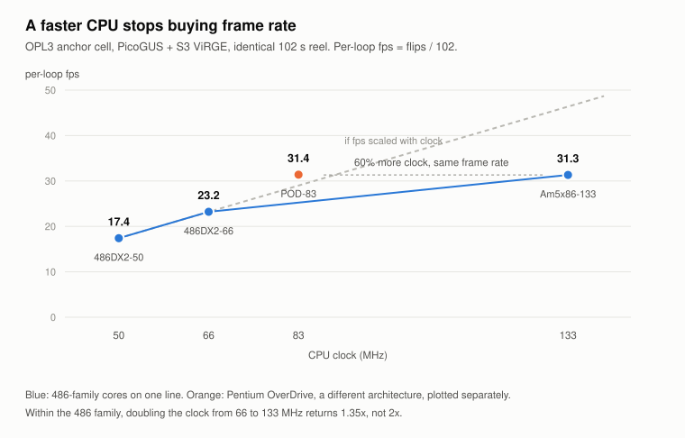
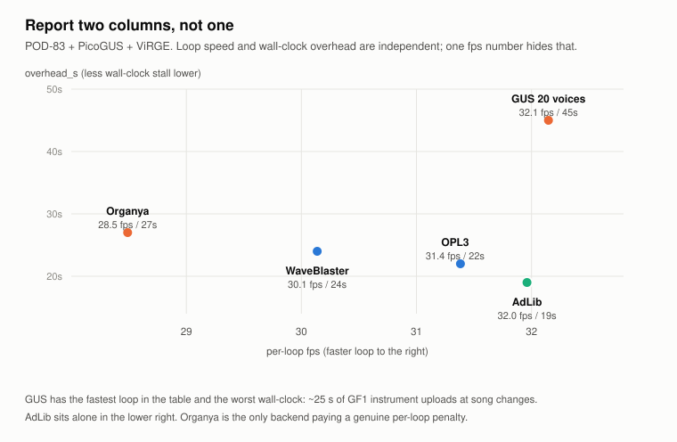
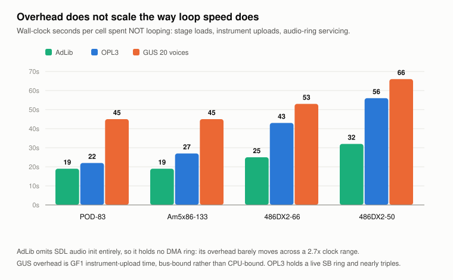
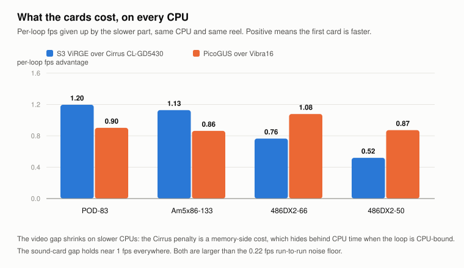

# Benchmark results

Real-hardware measurements of DOSKUTSU on four vintage CPUs, taken with an
automated input replay so every configuration renders exactly the same 102
seconds of gameplay.

**157 cells over two rounds. Four CPUs. Three video cards, three sound cards,
seven music backends. One input recording, every cell running the complete
route.**

Raw logs for every cell are committed under [`qa-results/`](../qa-results/).

---

## Round 2 -- current figures

Round 2 (binary `fe44805fb603`, 68 cells) re-measured every CPU against the
same recording. **These are the current numbers; the detailed sections below
are round 1 (`09e449c5a81d`) and its charts are drawn from that data.**

| CPU | AdLib | OPL3 FM | Organya | Organya-HQ |
|---|---|---|---|---|
| Pentium OverDrive 83 | **32.95** | 30.92 | 28.44 | 20.45 |
| Am5x86-133 | **32.78** | 31.03 | 28.52 | 20.35 |
| 486DX2-66 | **24.88** | 22.92 | 20.70 | 13.29 |
| 486DX2-50 | **18.59** | 17.40 | 14.99 | 14.13 |

Frames per second of game time, best cell per backend. AdLib leads on every
CPU. Organya-HQ costs about a quarter of the frame rate on the faster parts;
on the DX2-50 the loss moves out of the frame rate and into loading stalls
instead, which is why its figure looks close to plain Organya and is not.

**What changed since round 1**

| | |
|---|---|
| Music timebase fix (`SDL/0122`) | +0.13 to +0.88 fps, more on faster CPUs |
| AdLib | up 0.70 to 1.31 fps on every CPU |
| OPL3 FM | down ~1% on every CPU, cause not yet identified |
| Organya | unchanged |

Round 1 and round 2 agree above about 2%; below that the OPL3 shift matters.
Full comparison and method: [`qa-results/MATRIX-ROUND2.md`](../qa-results/MATRIX-ROUND2.md).

---

## What the numbers mean

Every cell replays the same recorded input -- the same 102 seconds of game
time, the same rooms, the same music changes. That makes cells comparable
across machines, which is the whole point.

Two numbers come out of each cell, and **both matter**:

| Metric | What it is | What it tells you |
|---|---|---|
| **per-loop fps** | `flips / 102` | how fast the game loop runs |
| **overhead_s** | `render_s - 102` | wall-clock seconds spent *not* looping -- stage loads, instrument uploads |

A single frame-rate number conflates them. A backend can have the fastest loop
in the table and still feel worst, because it spends half a minute stalled at
song changes. That is not hypothetical -- it is exactly what the Gravis
UltraSound does.

Frame rate is reported as `per-loop fps` throughout. Where a cell's clock is
trustworthy, a conventional median frame rate is given alongside it.

---

## Finding 1: a faster CPU stops buying frame rate

The Am5x86-133 has **60% more clock** than the Pentium OverDrive 83 and renders
at **the same speed**. Within the 486 family alone, doubling the clock from 66
to 133 MHz returns 1.35x, not 2x.

Both machines run the same 33 MHz bus on the same motherboard. Whatever the
render loop is waiting on, it is not clock cycles.

**This is the practical answer to "what hardware do I need?"** Past roughly a
486DX4-100, spending more on the CPU stops improving how the game draws. It
still improves *loading* -- see finding 3.

| Music backend | POD-83 | Am5x86-133 | 486DX2-66 | 486DX2-50 |
|---|---|---|---|---|
| GUS, 20 voices | **32.1** / 45s | **31.9** / 45s | **24.2** / 53s | **18.3** / 66s |
| AdLib / OPL2 | **32.0** / 19s | **31.8** / 19s | **23.6** / 25s | **17.9** / 32s |
| OPL3 FM  (default) | **31.4** / 22s | **31.3** / 27s | **23.2** / 43s | **17.4** / 56s |
| Sound Blaster AUTO | **31.6** / 25s | **31.4** / 30s | **23.2** / 43s | **17.4** / 57s |
| Organya (software synth) | **28.5** / 27s | **28.2** / 32s | **20.0** / 48s | **14.7** / 68s |
| WaveBlaster (DreamBlaster) | **29.0** / 24s | **29.1** / 32s | **21.6** / 47s | **16.2** / 60s |
| Organya-HQ 22050 stereo | 20.4 / 55s | 20.1 / 64s | 13.6 / 96s | 14.1 / 181s |

Per-loop fps / overhead seconds. Best value in each column in bold.
Organya-HQ is the optional 22050 Hz stereo tier, shown for completeness.

---

## Finding 2: report two columns, not one

The Gravis UltraSound has the **fastest game loop of any backend** and the
**worst wall-clock time**. Its entire deficit is about 25 seconds of GF1
instrument uploads at song transitions -- a loading problem, not a synthesis
cost, and therefore fixable in a way a per-frame cost would not be.

AdLib sits alone in the lower right: fast loop, lowest overhead of anything.
Organya is the only backend paying a genuine per-loop penalty, which matches
its reputation as the expensive option.

| Cell | Backend | per-loop fps | overhead_s | median fps |
|---|---|---|---|---|
| `G23B` | GUS, 32 voices | 32.3 | 48 | _pump - invalid_ |
| `G62` | AdLib, SFX off | 32.2 | 18 | _pump - invalid_ |
| `G22` | GUS, 20 voices | 32.1 | 45 | _pump - invalid_ |
| `G41` | AdLib | 32.0 | 19 | _pump - invalid_ |
| `G23A` | GUS, 14 voices | 32.0 | 47 | _pump - invalid_ |
| `G60` | music + SFX off | 31.8 | 22 | 32.3 |
| `G51` | SB AUTO | 31.6 | 25 | 33.3 |
| `G61` | OPL3, SFX off | 31.5 | 24 | 32.3 |
| `GC4` | OPL3 FM | 31.4 | 22 | 32.3 |
| `G17` | WaveBlaster | 30.1 | 24 | 32.3 |
| `GC3` | Organya | 28.5 | 27 | 29.4 |

Cells marked *pump - invalid* run a music timer that reprograms the PC's
interval timer, which is also the timebase the conventional frame-rate median
is derived from. Those medians are meaningless and are withheld rather than
printed; `per-loop fps` is measured on an independent clock and stays valid.

---

## Finding 3: overhead scales differently from frame rate

Frame rate and loading time do not degrade together on slower hardware.

- **AdLib barely moves** across a 2.7x clock range (19s to 32s). It skips audio
  initialisation entirely, so there is no DMA ring to service.
- **GUS barely moves either** (45s to 66s), because its overhead is instrument
  upload time over the bus, which does not get faster with the CPU.
- **OPL3 nearly triples** (22s to 56s). It holds a live Sound Blaster DMA ring,
  and servicing that ring is CPU work.

So the gap between AdLib and OPL3 widens from **3 seconds** on the POD-83 to
**24 seconds** on the 486DX2-50. On slower machines the music backend matters
far more for loading time than the frame-rate table suggests.

---

## Finding 4: what the cards cost

| CPU | ViRGE | Cirrus | video cost | PicoGUS | Vibra16 | sound cost |
|---|---|---|---|---|---|---|
| POD-83 | 31.60 | 30.40 | **1.20** | 31.38 | 30.48 | **0.90** |
| Am5x86-133 | 31.27 | 30.15 | **1.13** | 31.32 | 30.46 | **0.86** |
| 486DX2-66 | 23.19 | 22.42 | **0.76** | 23.22 | 22.14 | **1.08** |
| 486DX2-50 | 17.42 | 16.90 | **0.52** | 17.39 | 16.52 | **0.87** |

The **S3 ViRGE beats the Cirrus CL-GD5430 by about 1.2 fps** -- but not because
the Cirrus is slower silicon. DOSKUTSU deliberately refuses the Cirrus's linear
framebuffer and writes through a 64 KB window instead, because that card's
aperture does not reliably reach the display under UniVBE. The 1.2 fps is the
price of a correctness workaround, and it is not recoverable.

Note the video gap *shrinks* on slower CPUs while the sound gap does not. A
memory-side cost hides behind CPU time when the processor is the bottleneck;
that it reappears on the fast machines is consistent with those machines being
limited by something other than the CPU.

The **PicoGUS beats a real Vibra16 by about 0.9 fps** on every CPU tested. The
two cards resolve to different DMA widths, so card and transfer width are
confounded; which one is responsible is not yet established.

---

## Finding 5: below 83 MHz, everything scales with the clock

The 486DX2-50 runs a 25 MHz bus and a 50 MHz core against the DX2-66's 33 and
66 -- **both exactly 0.75x**. A system whose cost is proportional to clock
speed should therefore show 0.75 on every measurement, and the interesting
result is any departure from it.

19 of 22 cells landed within 1.3% of 0.75. The departures are not noise; they
sort by backend:

| Backend | DX2-66 | DX2-50 | ratio | reading |
|---|---|---|---|---|
| AdLib | 23.56 | 17.92 | 0.7607 | above - fixed non-CPU cost |
| GUS, 20 voices | 24.24 | 18.30 | 0.7553 | above - fixed non-CPU cost |
| OPL3 FM | 23.22 | 17.39 | 0.7492 | on 0.75 |
| SB AUTO | 23.21 | 17.39 | 0.7495 | on 0.75 |
| WaveBlaster | 21.59 | 16.25 | 0.7525 | on 0.75 |
| OPL3 (Vibra16) | 22.14 | 16.52 | 0.7462 | on 0.75 |
| Organya | 20.04 | 14.74 | 0.7353 | below - superlinear |

A cost that does *not* scale with the clock -- an interrupt at a fixed rate, a
transfer at bus speed -- pushes the ratio **above** 0.75. Both backends that do
so are ones already identified as bus-bound rather than CPU-bound, by an
entirely separate measurement. Organya alone degrades *worse* than clock on
both axes.

---

## How this was measured

- **One binary** for every cell (`09e449c5a81d`), one recorded input, one
  motherboard. Only the named part changes between lanes.
- **Hardware is confirmed from the logs**, not assumed: video mode and
  framebuffer path, sound card identity and DMA path are each read back per
  cell.
- **Every cell completed the full route.** A cell that ends early has rendered
  less work and is not comparable; those are discarded, not adjusted.
- **Run-to-run noise is about 0.2 fps**, measured from configurations that
  appear twice. Differences smaller than that are not claimed.

## What is not established

Kept deliberately, because a benchmark table without its limits invites
over-reading:

- **Why** a faster CPU stops helping is not settled. A shared memory or bus
  ceiling fits the data; so does the possibility that a Pentium at 83 MHz and a
  486 at 133 MHz simply happen to be worth the same on this workload. No CPU
  available for this board can separate them, because 486 multipliers tie core
  speed to bus speed. A bandwidth probe at fixed CPU would settle it.
- **The CPU is the one thing no log witnesses.** Video and sound hardware are
  each confirmed from log evidence; the processor is identified by the operator
  telling the test script which chip is installed.
- **Organya-HQ on the two slowest CPUs needs re-measuring.** The 486DX2-50
  scored *higher* than the 486DX2-66 on that cell, which cannot be true of
  identical work, so both figures are suspect and excluded from every
  conclusion above.
- These figures do not transfer to a different scene. The reel averages light
  and heavy rooms; a heavy parallax scene runs slower than any number here.

## Reading further

| | |
|---|---|
| Raw logs, all 157 cells | [`qa-results/`](../qa-results/) |
| Cross-CPU analysis | [`qa-results/MATRIX-CROSS-CPU.md`](../qa-results/MATRIX-CROSS-CPU.md) |
| Audio-backend matrix | [`qa-results/MATRIX-POD83.md`](../qa-results/MATRIX-POD83.md) |
| Video-card matrix | [`qa-results/MATRIX-VIDEO-POD83.md`](../qa-results/MATRIX-VIDEO-POD83.md) |
| How the replay harness works | [`docs/TAS-BENCHMARKING.md`](TAS-BENCHMARKING.md) |
| What each cell measures | [`docs/QA-CELL-REFERENCE.md`](QA-CELL-REFERENCE.md) |
| Choosing a sound configuration | [`docs/SOUND.md`](SOUND.md) |
